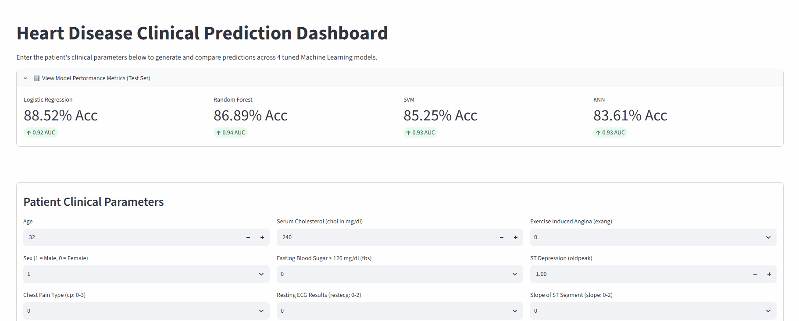
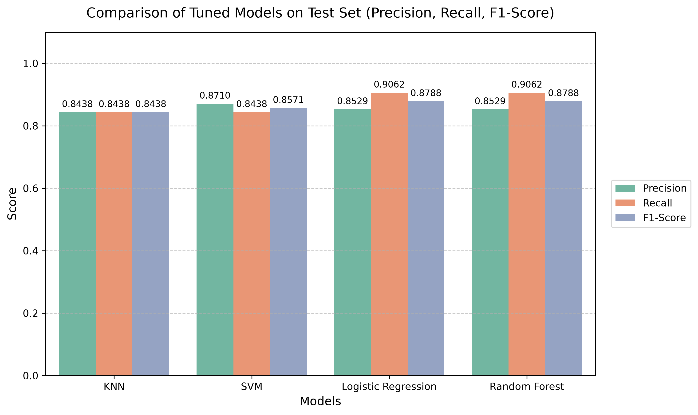
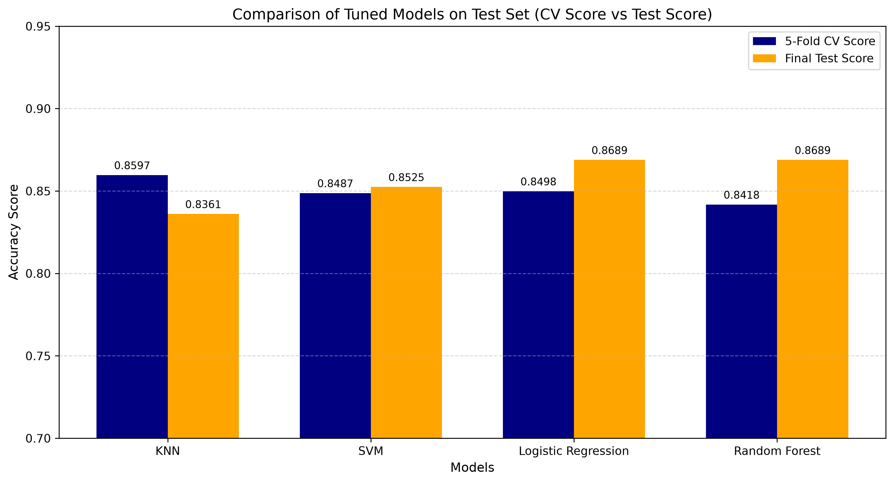
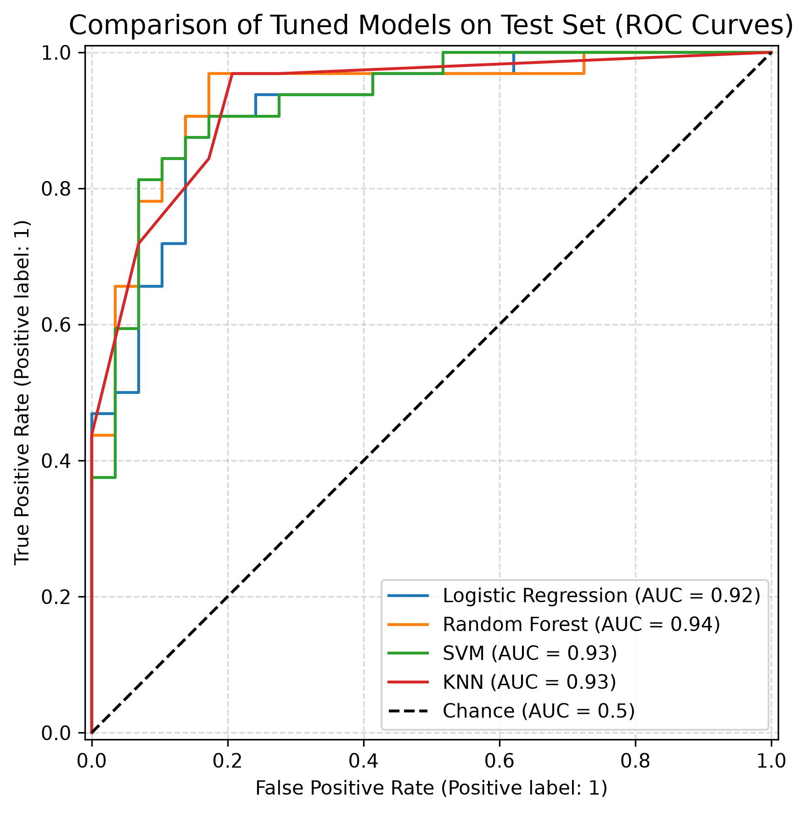
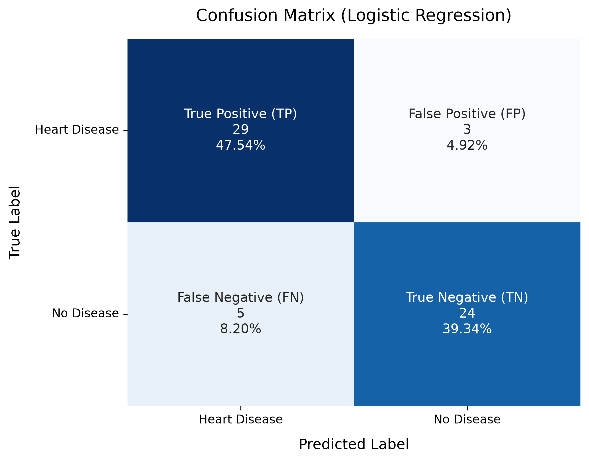

# Heart Disease Classification

## Overview

This project provides an end-to-end Machine Learning solution to predict the presence of heart disease based on patient clinical parameters. By analyzing 13 key diagnostic metrics (including chest pain type, maximum heart rate, and ST depression), the pipeline evaluates multiple classification algorithms to deliver accurate risk assessments.

> For in-depth details for Exploratory Data Analysis (EDA), Model Selection and Tuning, and Results, please refer to the [Full Technical Report](heart_disease_report.md).

---

## Demo



**Try the Live Interactive Web App:** [Heart Disease Predictor on Streamlit Cloud](https://heart-disease-predictor-g48xbmhfva6fnmwbucvng6.streamlit.app)

---

## Key Features & Highlights

* **Multi-Model Evaluation:** Systematic benchmarking across four distinct classification algorithms:
  * Logistic Regression
  * K-Nearest Neighbors (KNN)
  * Support Vector Classifier (SVC)
  * Random Forest Classifier
* **Hyperparameter Optimization:** Fine-tuning via `RandomizedSearchCV` and `GridSearchCV` to maximize clinical recall.
* **Clinical Interpretability:** Feature importance mapping to highlight primary medical indicators driving risk predictions.
* **Interactive Web Interface:** A lightweight Streamlit app allowing clinicians or users to input custom parameters and receive real-time probability scores.

---

## Key Results

### 1. Model Performance Comparison

We evaluated the tuned candidate models on the unseen test set across multiple metrics to diagnose generalization and threshold performance.

| Performance Metrics Benchmark | Generalization (Train vs. Test) |
| :---: | :---: |
|  |  |
| **Figure 1:** Precision, Recall, and F1-Score trade-off. | **Figure 2:** Overfitting check across models. |

* **Model Generalization:** **Logistic Regression** and **Random Forest** demonstrated superior generalization on the unseen test set compared to **KNN** and **SVM**, which showed signs of slight overfitting during training.

### 2. Champion Model Deep-Dive (Logistic Regression)

| Discrimination Power (ROC Curve) | Diagnostic Reliability (Confusion Matrix) |
| :---: | :---: |
|  |  |
| **Figure 3:** ROC-AUC threshold performance. | **Figure 4:** Low False Negative rate in clinical diagnosis. |

* **Clinical Metric Alignment:** **Logistic Regression** achieved the optimal balance, delivering the highest **Recall** and **F1-Score**. This minimizes False Negatives—ensuring high-risk heart disease patients are correctly identified for timely medical intervention.

### 3. Feature Importance & Model Interpretability

| Linear Model Risk Factors (LogReg) | Tree-Based Risk Factors (Random Forest) |
| :---: | :---: |
|  |  |
| **Figure 5:** LogReg Coefficients Importance. | **Figure 6:** Random Forest Feature Importance. |

* **Key Clinical Risk Factors:** Across both linear and tree-based models, **`ca`** (number of major vessels), **`cp`** (chest pain type), **`oldpeak`** (ST depression), **`thal`** (thalium stress result), and **`exang`** (exercise-induced angina) emerged as the primary predictors for heart disease risk.
---

## Tech Stack

* **Language:** Python `3.12.12`
* **Data Processing & Analysis:** Pandas, NumPy
* **Machine Learning:** Scikit-Learn
* **Visualization:** Matplotlib, Seaborn
* **Model Persistence:** Joblib
* **Web Framework:** Streamlit

---

## Project Structure

```text
heart-disease-predictor/
├── assets/
│   └── demo.gif                        # Demonstration GIF for README
├── heart-disease.csv                   # Clinical dataset
├── heart_disease_classification.ipynb  # Complete Machine Learning pipeline
├── heart_disease_report.md             # Comprehensive technical report
├── app.py                              # Interactive Streamlit web application
├── requirements.txt                    # Python dependencies
└── README.md                           # Project documentation
```

The execution pipeline automatically generates and manages the following runtime directories:

```text
├── models/                             # Stores trained model files
└── plots/                              # Generated visualizations
    ├── EDA/                            # Exploratory Data Analysis plots
    ├── Tuning/                         # Hyperparameter tuning
    ├── Evaluation/                     # Evaluation metrics
    └── Features/                       # Feature importance visualizations
```

---

## How to Run

First clone the repository:
```bash
git clone https://github.com/BevisWong76/heart-disease-predictor.git
cd heart-disease-predictor
```

You can then set up the project locally using either the standard Python `venv` or the ultra-fast `uv` package manager.

### Option 1: Using Standard Python `venv` (Traditional)

1. Create a virtual environment:
```bash
python -m venv .venv
```

2. Activate the virtual environment:
```bash
# Windows (Command Prompt):
.venv\Scripts\activate.bat

# Windows (PowerShell):
.venv\Scripts\Activate.ps1

# macOS / Linux:
source .venv/bin/activate
```

3. Install dependencies:
```bash
pip install --upgrade pip
pip install -r requirements.txt
```

### Option 2: Using `uv` (Recommended for Speed)

`uv` is an extremely fast Python package installer and resolver written in Rust.

1. Install `uv` (if you haven't already):
```bash
pip install uv
```

2.  Create a virtual environment:

```bash
uv venv
```

3. Activate the virtual environment:
```bash
# Windows (Command Prompt):
.venv\Scripts\activate.bat

# Windows (PowerShell):
.venv\Scripts\Activate.ps1

# macOS / Linux:
source .venv/bin/activate
```

 4. Install dependencies:
```bash
uv pip install --upgrade pip
uv pip install -r requirements.txt
```

### Run the Streamlit App

Once the dependencies are installed and the model artifacts are generated, launch the interactive web application:

```bash
streamlit run app.py
```

---

## Acknowledgements

* **Dataset:** Cleveland Heart Disease Dataset from the [UCI Machine Learning Repository](https://archive.ics.uci.edu/ml/datasets/Heart+Disease).

* **Inspiration:** Built upon foundational concepts from the [Zero to Mastery Machine Learning Course](https://github.com/mrdbourke/zero-to-mastery-ml).


## Key Enhancements Beyond Baseline
* **Robust Pipeline Architecture:** End-to-end `Pipeline` workflows preventing data leakage and standardizing feature transformations.
* **Advanced Benchmarking & Tuning:** Comprehensive evaluation and hyperparameter tuning across 4 models.
* **Model Interpretability:** Deep-dive analysis on feature importance and model interpretability.
* **Interactive Web App:** Production-ready prediction dashboard deployed via **Streamlit**.