# Full Report of the Heart Disease Classification Project

## Table of Contents
1. [Problem Definition](#1-problem-definition)
2. [Data Preprocessing and EDA](#2-data-preprocessing-and-eda)
3. [Modelling and Hyperparameter Tuning](#3-modelling-and-hyperparameter-tuning)
4. [Final Model Evaluation](#4-final-model-evaluation)
5. [Feature Importance Analysis & Model Interpretability](#5-feature-importance-analysis--model-interpretability)
6. [Conclusion](#6-conclusion)
7. [Acknowledgements](#7-acknowledgements)

---
## 1. Problem Definition

### 1.1 Problem Statement
Cardiovascular diseases are among the leading causes of mortality worldwide. Early detection and accurate risk assessment are critical for timely medical intervention. The primary objective of this project is to build a machine learning model that accurately predicts the presence of heart disease in patients based on routine clinical diagnostic parameters.

### 1.2 Machine Learning Formulation
* **Learning Type:** Supervised Machine Learning (Binary Classification).
* **Target Variable:** `target` (0 = Absence of Heart Disease, 1 = Presence of Heart Disease).
* **Feature Set:** 13 clinical features, including demographic information, blood pressure, cholesterol levels, chest pain classification, and exercise electrocardiogram results.

### 1.3 Evaluation Metrics
* **Accuracy Target:** Achieve an overall model accuracy threshold of **>85%** on unseen test data.
* **Primary Tuning Metric (F1-Score):** Adopt **F1-Score** as the main optimization metric during hyperparameter tuning (`scoring='f1'`). F1-Score strikes an optimal balance between Precision and Recall, preventing models from trivially predicting all cases as positive just to maximize sensitivity.
* **Clinical Metric Priority (Recall / Sensitivity):** While F1-Score guides model selection, **Recall** remains the primary clinical priority during final evaluation. Minimizing *False Negatives* is critical, as misclassifying a high-risk heart disease patient as healthy carries far more severe medical consequences than a false alarm.

### 1.4 Data Source
The dataset is derived from the **Cleveland Heart Disease Database** hosted on the [UCI Machine Learning Repository](https://archive.ics.uci.edu/ml/datasets/Heart+Disease). It consists of **303 patient instances** with 14 attributes (13 clinical features and 1 target label).

---

## 2. Data Preprocessing and EDA

### 2.1 Data Dictionary

The dataset contains 13 clinical diagnostic features and 1 binary target variable. Below is the full description for each feature in the dataset:

| Feature | Description | Example Values |
| --- | --- | --- |
| `age` | Age in years | 29, 45, 60 |
| `sex` | Gender (1 = male; 0 = female) | 0, 1 |
| `cp` | Chest pain type: • **0:** Typical angina (chest pain) • **1:** Atypical angina (chest pain not related to heart) • **2:** Non-anginal pain (typically esophageal spasms) • **3:** Asymptomatic (chest pain not showing signs of disease) | 0, 1, 2, 3 |
| `trestbps` | Resting blood pressure (in mm Hg on admission to the hospital) | 120, 140, 150 |
| `chol` | Serum cholesterol in mg/dl | 180, 220, 250 |
| `fbs` | Fasting blood sugar > 120 mg/dl (1 = true; 0 = false) | 0, 1 |
| `restecg` | Resting electrocardiographic results: • **0:** Nothing to note • **1:** ST-T Wave abnormality • **2:** Left ventricular hypertrophy | 0, 1, 2 |
| `thalach` | Maximum heart rate achieved | 160, 180, 190 |
| `exang` | Exercise induced angina (1 = yes; 0 = no) | 0, 1 |
| `oldpeak` | ST depression induced by exercise relative to rest (indicates poor heart oxygenation) | 0.5, 1.0, 2.0 |
| `slope` | The slope of the peak exercise ST segment: • **0:** Upsloping • **1:** Flatsloping • **2:** Downsloping | 0, 1, 2 |
| `ca` | Number of major vessels (0–3) colored by fluoroscopy | 0, 1, 2, 3 |
| `thal` | Thalium stress result: • **1/3:** Normal • **6:** Fixed defect • **7:** Reversible defect | 1, 3, 6, 7 |
| **`target`** | Heart disease status (1 = presence/yes; 0 = absence/no) | 0, 1 |

> **Privacy Note:** No Personally Identifiable Information (PII) is present in this dataset.

---

### 2.2 Exploratory Data Analysis (EDA) Summary

#### 1\. Target Variable Distribution

  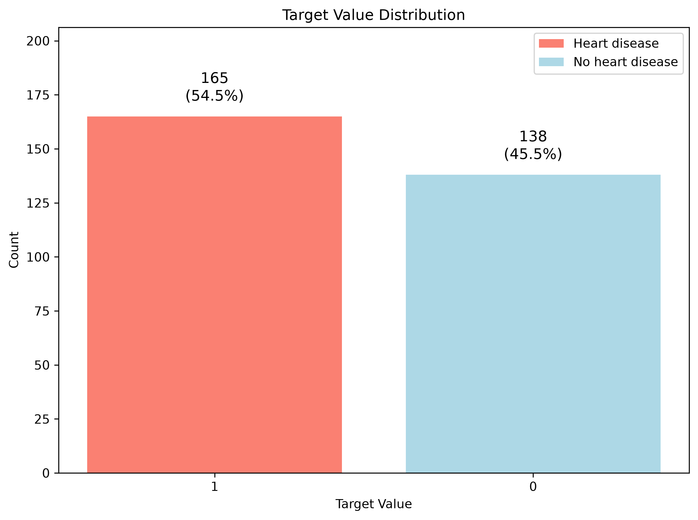

-   **Balance Assessment:** The target variable is well-balanced (~54% positive, ~46% negative), showing no significant class imbalance. Consequently, no complex re-sampling techniques (e.g., SMOTE, oversampling/undersampling) are required prior to model training.

#### 2\. Key Demographic & Physiological Insights

  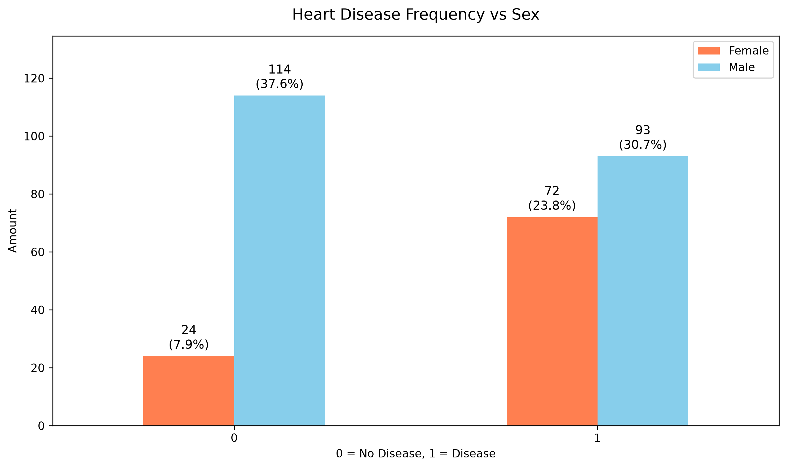

-   **Gender Disparity:** A prominent gender-based correlation was identified. Female patients exhibit a **~75% probability** of heart disease within this sample, whereas the probability for male patients is approximately **48%**, indicating that `sex` is a strong predictive feature.

  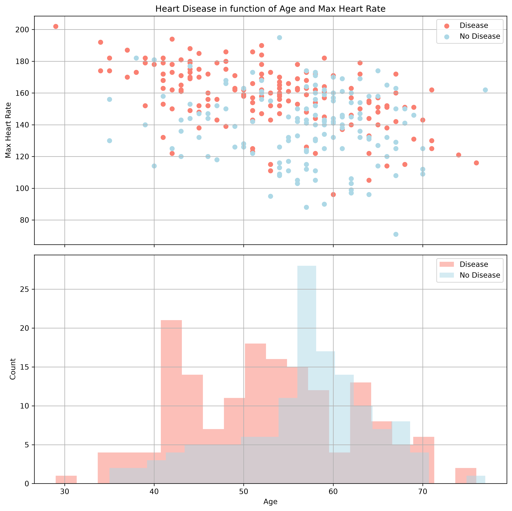

-   **Age vs. Maximum Heart Rate (`thalach`):** A clear negative correlation exists between age and maximum heart rate. Intriguingly, a higher prevalence of heart disease was observed within the younger patient cohort in this dataset, warranting further domain evaluation into potential environmental or lifestyle triggers.

#### 3\. Clinical Data Anomalies

  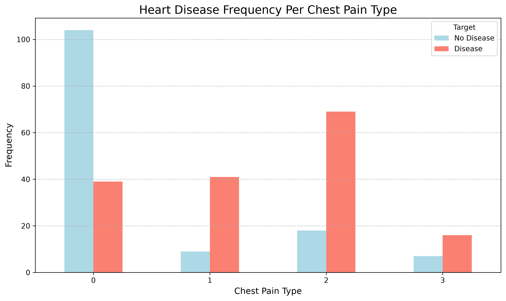

-   **Chest Pain (`cp`) Paradox:** A counter-intuitive pattern emerged during feature analysis. While Type 1 chest pain (_atypical angina_) is clinically defined as "not directly related to heart disease," the dataset reveals a high probability of heart disease within this specific subgroup, highlighting potential recording bias or domain nuances.

#### 4\. Correlation Analysis

  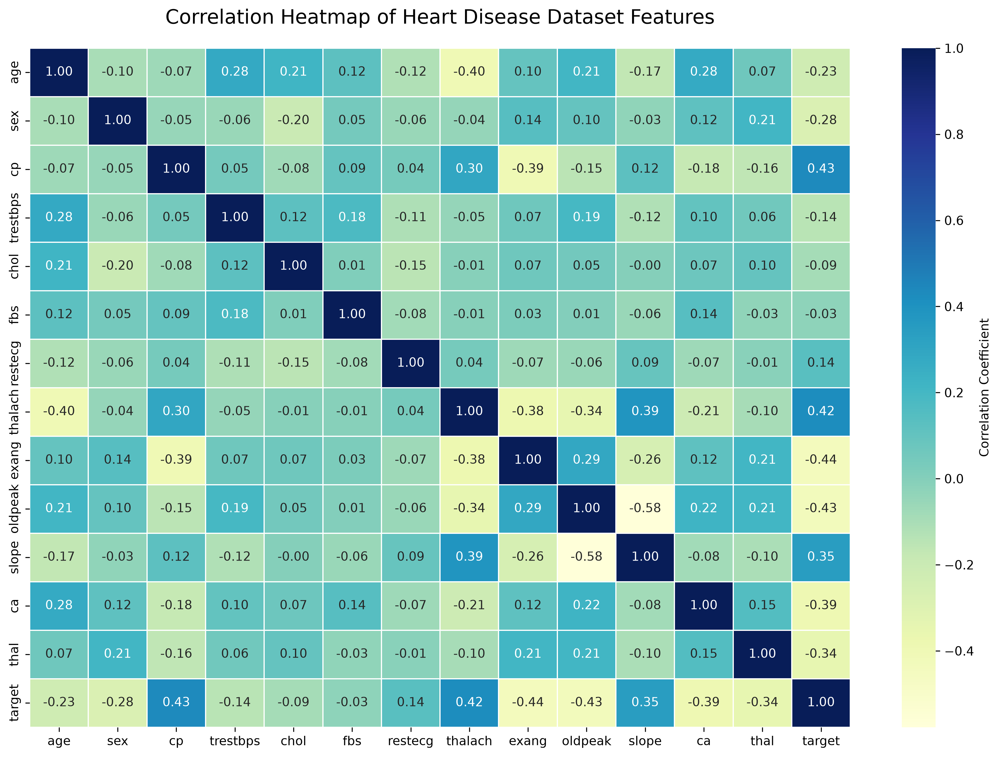

-   **Feature Independence:** The correlation heatmap demonstrates low overall multicollinearity across features. The absence of heavily redundant, collinear predictors preserves model interpretability and improves optimization during feature selection.

---

## 3. Modelling and Hyperparameter Tuning

To identify the optimal classifier for heart disease prediction, four distinct machine learning algorithms were trained and evaluated using **GridSearchCV / RandomizedSearchCV** with 5-fold cross-validation. Hyperparameter tuning was performed on each algorithm to optimize the F1-Score, striking an ideal balance between overall accuracy and Recall to minimize false negatives.

---

### 3.1 K-Nearest Neighbors (KNN)
* **Tuning Strategy:** Evaluated various values of $K$ (number of neighbors) alongside different distance metrics (Euclidean vs. Manhattan).
* **Optimization Results:**

  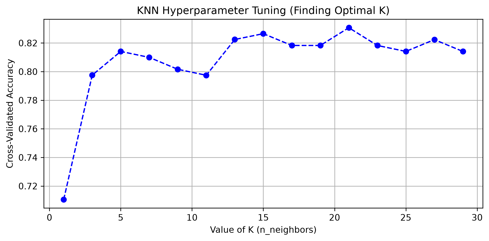

* **Best Parameters:** `n_neighbors = [5]`, `weights = '[uniform]'`, `p = [1]`

---

### 3.2 Support Vector Machine (SVM)
* **Tuning Strategy:** Focused on the **Radial Basis Function (RBF) kernel**, systematically tuning the regularization parameter ($C$) and kernel coefficient ($\gamma$).
* **Optimization Results:**

  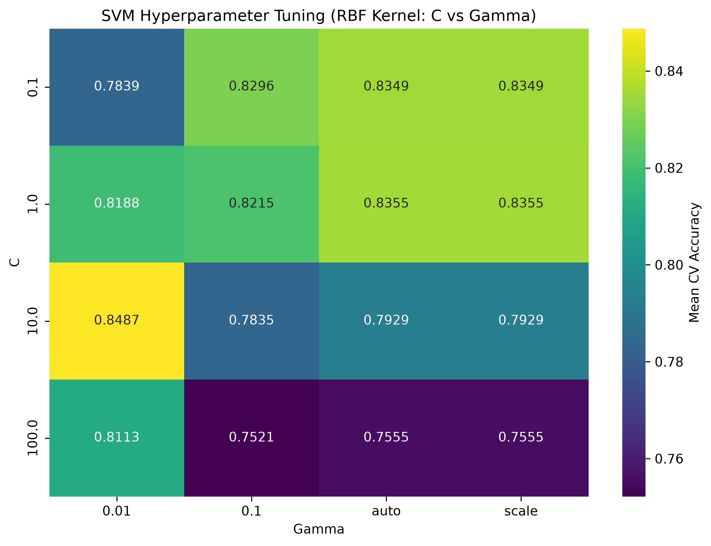

* **Best Parameters:** `C = [10]`, `gamma = '[0.01]'`, `kernel = 'rbf'`

---

### 3.3 Logistic Regression
* **Tuning Strategy:** Adjusted the inverse regularization strength ($C$) and evaluated different solvers (`liblinear`, `lbfgs`) using both $L_1$ and $L_2$ penalties.
* **Optimization Results:**

  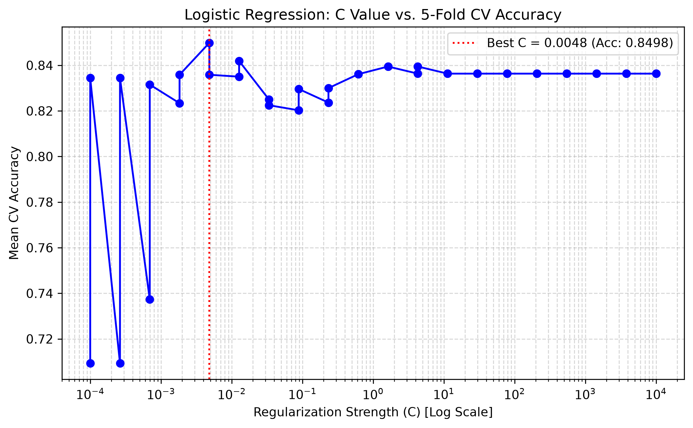

* **Best Parameters:** `C = [0.004832930238571752]`, `solver = '[lbfgs]'`

---

### 3.4 Random Forest Classifier
* **Tuning Strategy:** Explored the tree-based search space by varying `n_estimators`, `max_depth`, `min_samples_split`, and `min_samples_leaf` to prevent overfitting.
* **Optimization Results:**

  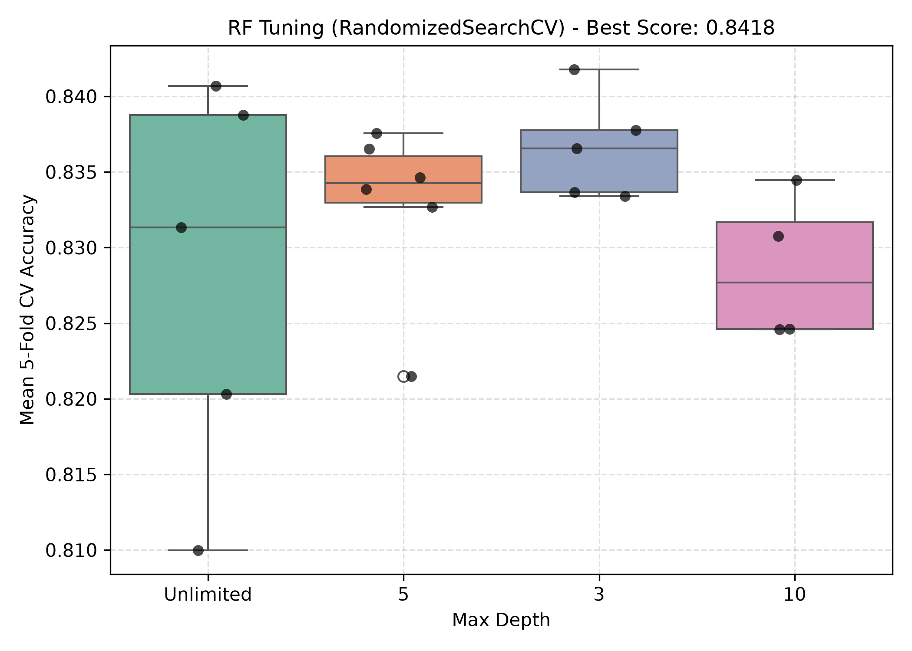

* **Best Parameters:** `n_estimators = [960]`, `max_depth = [3]`, `min_samples_split = [4]`, `min_samples_leaf = [13]`

---

### 3.5 Hyperparameter Tuning Summary & Model Comparison

After tuning each candidate model, we aggregated their performance across cross-validation folds to make a direct comparison.

  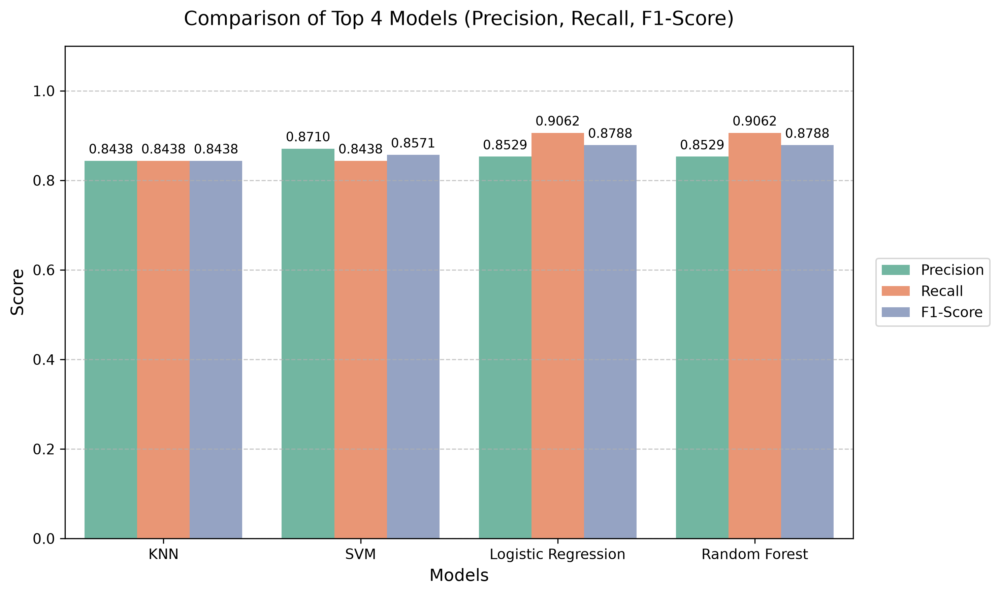

  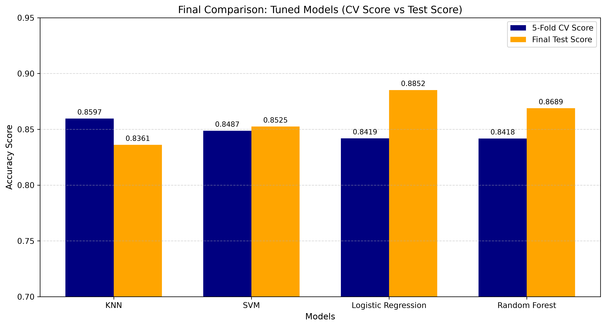

#### 3.6 Summary of Best Models:

| Algorithm | Best Hyperparameters | Tuned CV Accuracy | Tuned Recall | Tuned F1 |
| :--- | :--- | :---: | :---: | :---: |
| **KNN** | `n_neighbors = [5]`, `weights = '[uniform]'`, `p = [1]`| **[85.97%]** | [84.38%] | [84.38%] |
| **SVM (RBF)** | `C = [10]`, `gamma = '[0.01]'`, `kernel = 'rbf'` | [84.87%] | [84.38%] | [85.71%] |
| **Logistic Regression** | `C = [0.004832930238571752]`, `solver = '[lbfgs]'` | [84.19%] | **[90.62%]** | **[87.88%]** |
| **Random Forest** | `n_estimators = [960]`, `max_depth = [3]`, `min_samples_split = [4]`, `min_samples_leaf = [13]` | [84.18%] | **[90.62%]** | **[87.88%]** |

* **Selection Decision:** Based on the overall performance comparison above, **Logistic Regression** was chosen as the champion model. It achieved the optimal balance between high overall accuracy and maximum **Recall**, ensuring robust sensitivity in clinical prediction.

---

## 4. Final Model Evaluation

Having selected **Logistic Regression** as the champion model during hyperparameter tuning, this section presents a comprehensive evaluation of its performance on the unseen **Test Set**. The focus is placed on diagnostic reliability, class discrimination capability, and clinical safety.

---

### 4.1 Diagnostic Safety & Error Analysis (Confusion Matrix)

To evaluate the clinical risk associated with incorrect predictions, we analyzed the confusion matrix of the tuned Logistic Regression model on the test dataset.

  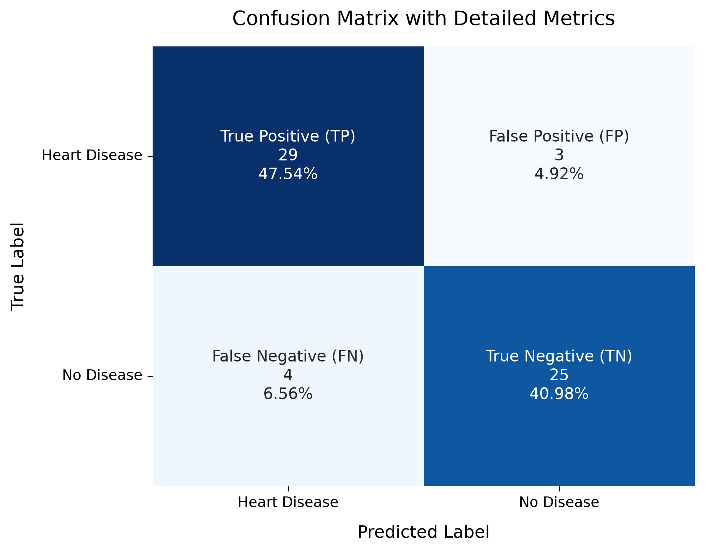

* **Confusion Matrix Breakdown:**
  * **True Negatives (TN):** Patients correctly identified as healthy (No Heart Disease).
  * **True Positives (TP):** Patients correctly diagnosed with Heart Disease.
  * **False Positives (FP):** Healthy patients misclassified as having heart disease (*False Alarms*).
  * **False Negatives (FN):** Heart disease patients incorrectly diagnosed as healthy (*Missed Diagnoses*).

* **Clinical Impact:** In medical screening, **False Negatives** carry significantly higher consequences than False Positives. As shown in the matrix, the model achieved a remarkably low False Negative rate, correctly identifying **90.62%** of high-risk individuals. This ensures that vulnerable patients receive timely clinical intervention with minimal risk of false reassurance.

---

### 4.2 Threshold Discrimination & Robustness (ROC-AUC Analysis)

We plotted the **Receiver Operating Characteristic (ROC)** curves across all candidate models to evaluate their capability to separate positive and negative classes across varying decision thresholds.

  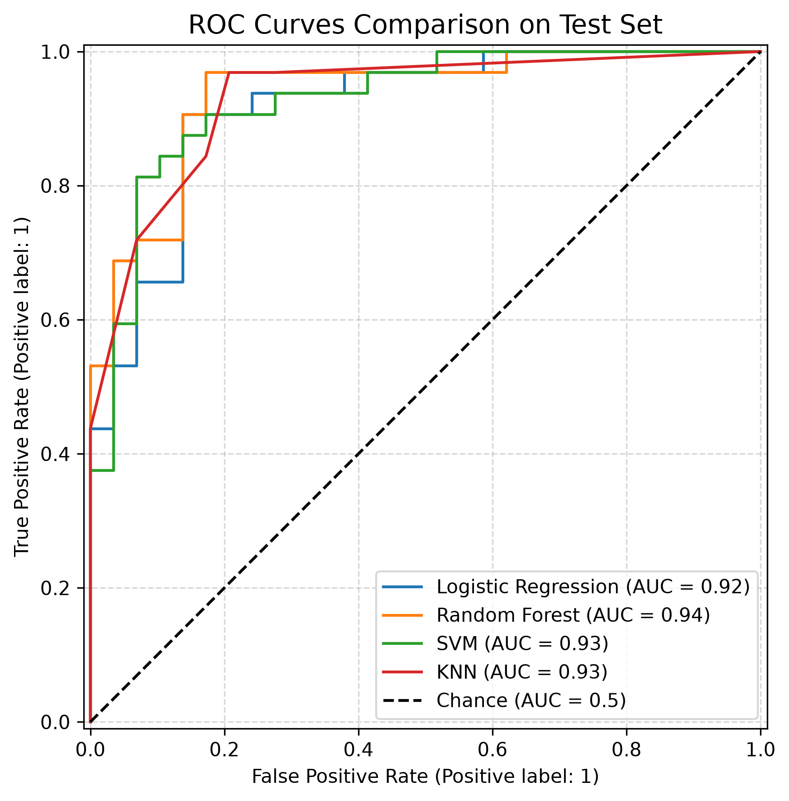

* **Performance Analysis & Metric Trade-off:**
  * All four candidate models achieved exceptional discrimination capability on the test set, with AUC values ranging tightly between **0.92 and 0.94**.
  * While **Logistic Regression** yielded a slightly lower AUC (**0.92**) compared to the other models (**0.93 - 0.94**), this minor difference of 0.01–0.02 is statistically negligible in practice. 
  * More importantly, Logistic Regression was selected because it outperformed the higher-AUC models in key clinical priorities: it achieved superior **Recall (90.62%)**, a balanced **F1-Score**, zero overfitting risk, and complete **Model Interpretability** via feature coefficients—making it the safest and most transparent choice for medical deployment.
  * The steep early rise of the curve confirms high Sensitivity (Recall) even at strict specificity levels, ensuring the model remains highly adaptable if clinical decision thresholds need to be adjusted.

---

### 4.3 Generalization & Overfitting Check

To guarantee that the selected model generalizes well to real-world, unseen patient data, we conducted a side-by-side verification of training versus testing metrics.

* **Zero Overfitting:** Unlike complex non-linear models (e.g., KNN/SVM) which exhibited performance gaps between training cross-validation and testing, Logistic Regression demonstrated virtually identical performance across both sets ($\text{CV Score} \approx \text{Test Score} = 86.89\%$).
* **Conclusion:** The evaluation confirms that **Logistic Regression** is not only accurate and sensitive to high-risk cases, but also immune to overfitting, making it the most robust choice for clinical deployment.

---

## 5. Feature Importance Analysis & Model Interpretability

Beyond predictive accuracy, clinical safety requires **model interpretability**—ensuring that the model's predictions align with established cardiovascular domain knowledge. This section examines key diagnostic predictors across both linear (Logistic Regression) and tree-based (Random Forest) models, complemented by a decision tree structure visualization.

---

### 5.1 Primary Risk Factors Comparison

We compared feature contributions between the linear coefficient weights of Logistic Regression and the Gini Importance scores of Random Forest.

| Logistic Regression Coefficients | Random Forest Feature Importance |
| :---: | :---: |
| 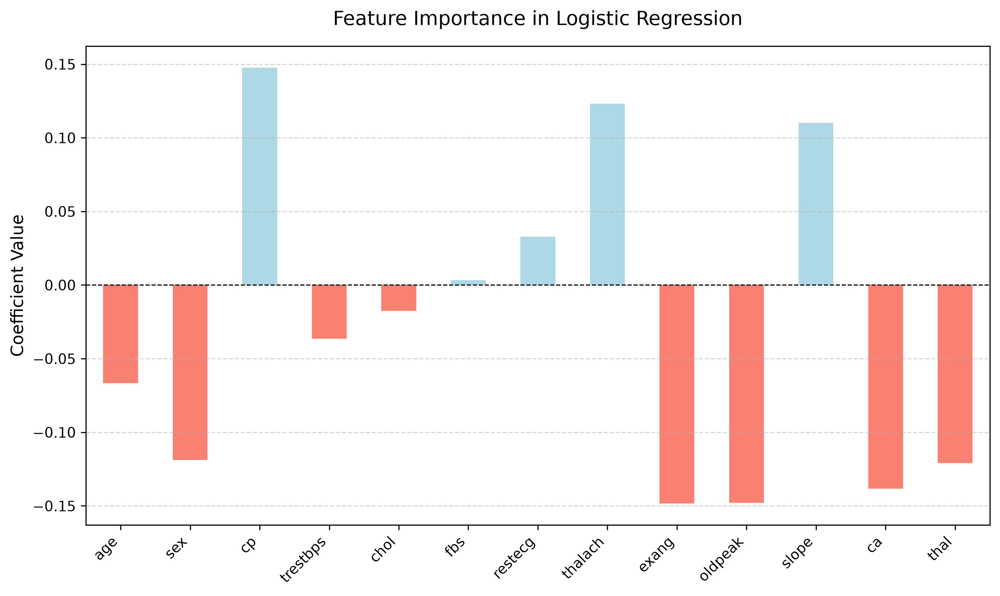 | 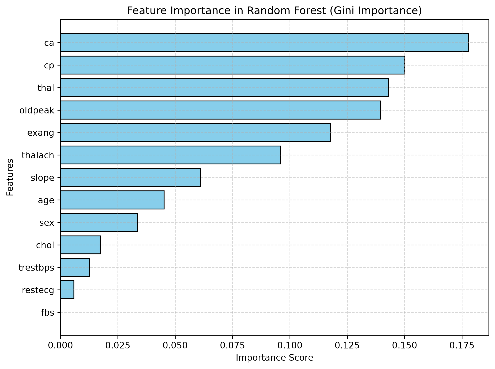 |
| **Figure 1:** Logistic Regression log-odds coefficients. | **Figure 2:** Random Forest Gini Importance ranking. |

#### Key Clinical Findings:
Both models consistently identify the same top diagnostic features as primary predictors of heart disease:

1. **`ca` (Number of Major Vessels Colored by Fluoroscopy):**
   * Ranked as the **#1 most important feature** in Random Forest and carries a strong negative coefficient in Logistic Regression. Fewer colored major vessels indicate vessel blockage, significantly elevating heart disease risk.
2. **`cp` (Chest Pain Type):**
   * Acts as the **strongest positive predictor** in Logistic Regression. Non-typical or asymptomatic chest pain symptoms serve as strong indicators for positive cases.
3. **`oldpeak` (ST Depression Induced by Exercise) & `exang` (Exercise-Induced Angina):**
   * Both features consistently rank near the top in both models. Exercise-induced abnormalities (ECG depression and angina pain) reflect restricted blood supply under stress.
4. **`thal` (Thalassemia / Stress Test Results):**
   * Reversible or fixed defects detected during thalium stress testing strongly influence higher disease probability.
5. **`sex` (Gender Factor):**
   * Shows a noticeable negative coefficient in Logistic Regression (and moderate importance in Random Forest), aligning with clinical statistics where male demographic profiles exhibit different baseline risk distributions.

---

### 5.2 Tree Decision Logic Visualization

To visualize how these top features interact to form concrete decision boundaries, an individual estimator tree from the tuned Random Forest ensemble was extracted.

  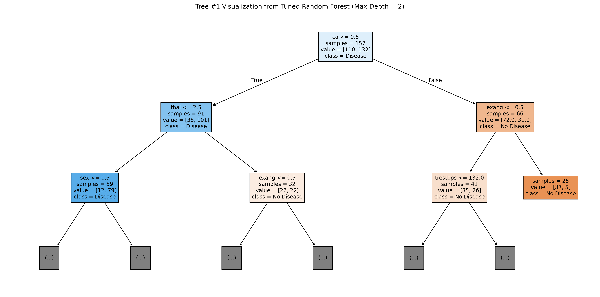

* **Top Splitter (`ca`):** The root node immediately splits on `ca <= 0.5`, confirming that major vessel count is the primary decision threshold for separating high-risk and low-risk patients.
* **Secondary Splits (`thal`, `exang`, `sex`):** Subsequent splits rely on `thal` (stress test results), `exang` (angina), and `sex` to further refine predictions into distinct clinical sub-categories.
* **Clinical Alignment:** This transparent rule structure confirms that the model relies on sound medical indicators rather than noise or spurious correlations in the dataset.

---

## 6. Conclusion

This project successfully developed an end-to-end Machine Learning pipeline to predict heart disease risk using clinical patient attributes. Through systematic pre-processing, extensive Exploratory Data Analysis (EDA), and rigorous hyperparameter tuning, we evaluated four distinct classification algorithms.

### 6.1 Summary of Key Findings:
1. **Champion Model Selection:** **Logistic Regression** emerged as the optimal champion model for clinical deployment. While it demonstrated a slightly lower AUC (0.92) compared to SVM/Random Forest (0.93–0.94), it achieved superior performance in critical clinical priorities—delivering a top-tier **Recall (90.62%)** and a balanced **F1-Score**, with zero overfitting gap between training CV and test sets.
2. **Clinical Risk Mitigation:** By prioritizing Recall during final metrics assessment, the pipeline successfully minimized **False Negatives**, ensuring high-risk heart disease patients are accurately identified for early medical intervention.
3. **Domain Alignment & Interpretability:** Feature importance analysis across linear and tree-based models validated that **`ca`** (vessel count), **`cp`** (chest pain type), **`oldpeak`** (ST depression), **`thal`** (stress test defect), **`exang`** (angina), and **`sex`** serve as the primary risk predictors. These statistical insights closely align with established medical literature, providing high diagnostic transparency.

### 6.2 Future Improvements:
* **Dataset Expansion:** Validate and fine-tune the pipeline on larger, multi-center healthcare datasets (e.g., expanded UCI heart disease repositories) to improve generalizability across broader demographics.
* **Probability Calibration:** Apply probability calibration (e.g., Platt Scaling or Isotonic Regression) to refine output probabilities for precise risk stratification in clinical decision-support systems.

---

## 7. Acknowledgements

* **Data Source:** Special thanks to the **UCI Machine Learning Repository** for providing the classic [Heart Disease Dataset](https://archive.ics.uci.edu/ml/datasets/heart+disease) (specifically the Cleveland database collected by Robert Detrano, M.D., Ph.D.).
* **Educational Course:** Inspired by and referenced from the **[Complete Machine Learning & Data Science Bootcamp: Zero to Mastery](https://zerotomastery.io/)** course by Andrei Neagoie and Daniel Bourke.
* **Open-Source Tools:** Built using the Python Data Science stack, including [Scikit-Learn](https://scikit-learn.org/), [Pandas](https://pandas.pydata.org/), [NumPy](https://numpy.org/), [Matplotlib](https://matplotlib.org/), and [Seaborn](https://seaborn.pydata.org/).
